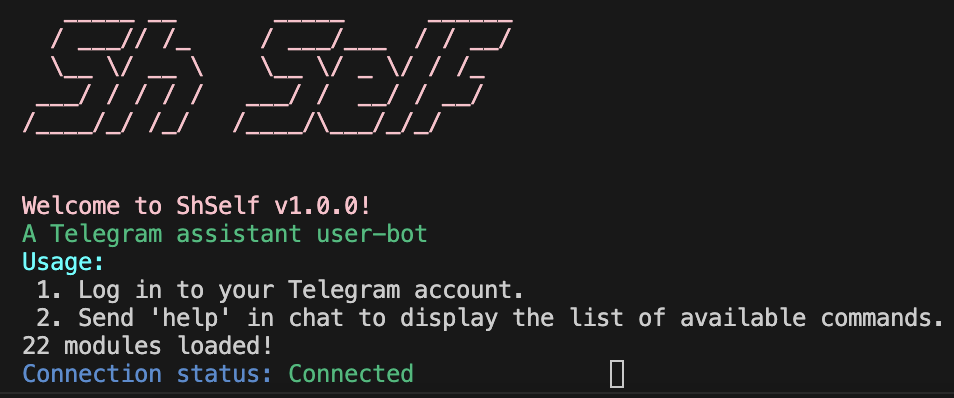

# Sh Self
[](https://github.com/alisalimik/sh_self/actions/workflows/dart_build.yml)  [](https://pub.dev/packages/lint)
```
   _____ __       _____      ______
  / ___// /_     / ___/___  / / __/
  \__ \/ __ \    \__ \/ _ \/ / /_  
 ___/ / / / /   ___/ /  __/ / __/  
/____/_/ /_/   /____/\___/_/_/     
                                   
```
## Table of Contents

- [About](#about)
- [Features](#features)
- [Getting Started](#getting-started)
  - [Prerequisites](#prerequisites)
  - [Installation](#installation)
- [Todo](#usage)
- [Usage](#modules)
- [License](#license)

## About

Yet another Telegram userbot written in dart by using Tdlib. work in progress!

## Features

- mute, unmute, mutelist
- reload animation in chat
- date time in chat
- server status
- spamming
- offline mode
- auto delete
- run dart code (eval)
- export account data (json & html)

## Getting Started

### Prerequisites

- MacOS (x64 & arm64), Windows(x64), Linux(x64) -> dart sdk [stable](https://dart.dev/get-dart) 3.1.0+ 
- Windows(arm64), Linux(arm64) -> dart sdk [dev channel](https://dart.dev/get-dart/archive#dev-channel) 3.2.0+
- (optional) [Visual studio code](https://code.visualstudio.com) for editing sorce code
- (optional) Telegram database library [1.8.15](https://github.com/tdlib/td/tree/f64268c50ddc52eb5bef9301224eac6287dd9535) pre-compiled [available](https://github.com/alisalimik/sh_self/releases/tag/tdlib-1.8.15)

### Installation 

Checkout [Actions](https://github.com/alisalimik/sh_self/actions/workflows/dart_build.yml) tab for latest automated builds or compile it yourself:
```bash
# Clone repo
git clone https://github.com/alisalimik/sh_self.git
cd sh_self
# Install dependencies
dart pub get
# build packager
dart compile aot-snapshot bin/build.dart -o ./build.aot
# package executable
dartaotruntime build.aot host
```
## Screenshots




## Usage

1. Run application for first time using terminal(not console!) to login.
2. Start a chat with your friend.
3. Send the command `reload` to initiate the reload process.
3. The bot will respond with a reloading animation and a success message.
5. Other commands comming soon...

## License

This project is licensed under the MIT License - see the [LICENSE](LICENSE) file for details.